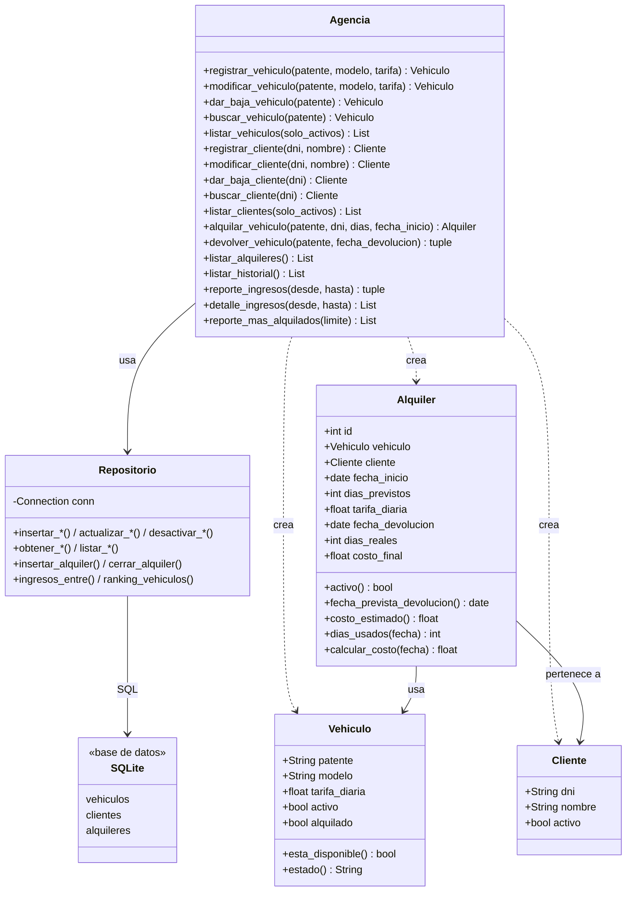

# Diagrama de Clases — AutoRent

```mermaid
classDiagram
    class Vehiculo {
        +String patente
        +String modelo
        +float tarifa_diaria
        +bool activo
        +bool alquilado
        +esta_disponible() bool
        +estado() String
    }

    class Cliente {
        +String dni
        +String nombre
        +bool activo
    }

    class Alquiler {
        +int id
        +Vehiculo vehiculo
        +Cliente cliente
        +date fecha_inicio
        +int dias_previstos
        +float tarifa_diaria
        +date fecha_devolucion
        +int dias_reales
        +float costo_final
        +activo() bool
        +fecha_prevista_devolucion() date
        +costo_estimado() float
        +dias_usados(fecha) int
        +calcular_costo(fecha) float
    }

    class Agencia {
        +registrar_vehiculo(patente, modelo, tarifa) Vehiculo
        +modificar_vehiculo(patente, modelo, tarifa) Vehiculo
        +dar_baja_vehiculo(patente) Vehiculo
        +buscar_vehiculo(patente) Vehiculo
        +listar_vehiculos(solo_activos) List
        +registrar_cliente(dni, nombre) Cliente
        +modificar_cliente(dni, nombre) Cliente
        +dar_baja_cliente(dni) Cliente
        +buscar_cliente(dni) Cliente
        +listar_clientes(solo_activos) List
        +alquilar_vehiculo(patente, dni, dias, fecha_inicio) Alquiler
        +devolver_vehiculo(patente, fecha_devolucion) tuple
        +listar_alquileres() List
        +listar_historial() List
        +reporte_ingresos(desde, hasta) tuple
        +detalle_ingresos(desde, hasta) List
        +reporte_mas_alquilados(limite) List
    }

    class Repositorio {
        -Connection conn
        +insertar_*() / actualizar_*() / desactivar_*()
        +obtener_*() / listar_*()
        +insertar_alquiler() / cerrar_alquiler()
        +ingresos_entre() / ranking_vehiculos()
    }

    class SQLite {
        <<base de datos>>
        vehiculos
        clientes
        alquileres
    }

    Agencia --> Repositorio : usa
    Repositorio --> SQLite : SQL
    Agencia ..> Vehiculo : crea
    Agencia ..> Cliente : crea
    Agencia ..> Alquiler : crea
    Alquiler --> Vehiculo : usa
    Alquiler --> Cliente : pertenece a
```
