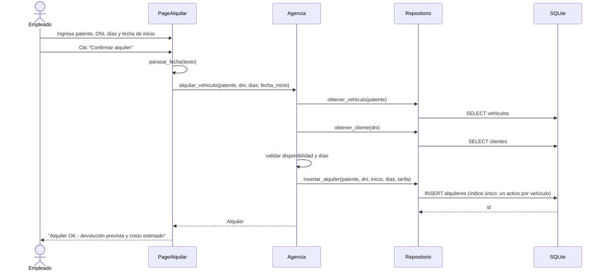
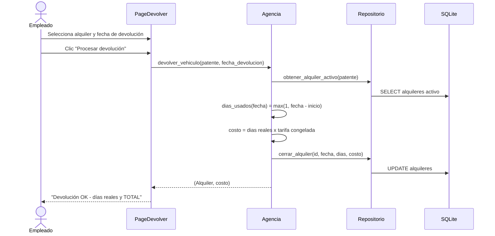

# Diagramas de Secuencia — AutoRent

## Flujo de alquiler

```mermaid
sequenceDiagram
    actor Empleado
    participant UI as PageAlquilar
    participant Agencia
    participant Repo as Repositorio
    participant DB as SQLite

    Empleado->>UI: Ingresa patente, DNI, días y fecha de inicio
    Empleado->>UI: Clic "Confirmar alquiler"
    UI->>UI: parsear_fecha(texto)
    UI->>Agencia: alquilar_vehiculo(patente, dni, dias, fecha_inicio)
    Agencia->>Repo: obtener_vehiculo(patente)
    Repo->>DB: SELECT vehiculos
    Agencia->>Repo: obtener_cliente(dni)
    Repo->>DB: SELECT clientes
    Agencia->>Agencia: validar disponibilidad y días
    Agencia->>Repo: insertar_alquiler(patente, dni, inicio, dias, tarifa)
    Repo->>DB: INSERT alquileres (índice único: un activo por vehículo)
    DB-->>Repo: id
    Agencia-->>UI: Alquiler
    UI-->>Empleado: "Alquiler OK - devolución prevista y costo estimado"
```

## Flujo de devolución

```mermaid
sequenceDiagram
    actor Empleado
    participant UI as PageDevolver
    participant Agencia
    participant Repo as Repositorio
    participant DB as SQLite

    Empleado->>UI: Selecciona alquiler y fecha de devolución
    Empleado->>UI: Clic "Procesar devolución"
    UI->>Agencia: devolver_vehiculo(patente, fecha_devolucion)
    Agencia->>Repo: obtener_alquiler_activo(patente)
    Repo->>DB: SELECT alquileres activo
    Agencia->>Agencia: dias_usados(fecha) = max(1, fecha - inicio)
    Agencia->>Agencia: costo = dias reales x tarifa congelada
    Agencia->>Repo: cerrar_alquiler(id, fecha, dias, costo)
    Repo->>DB: UPDATE alquileres
    Agencia-->>UI: (Alquiler, costo)
    UI-->>Empleado: "Devolución OK - días reales y TOTAL"
```
